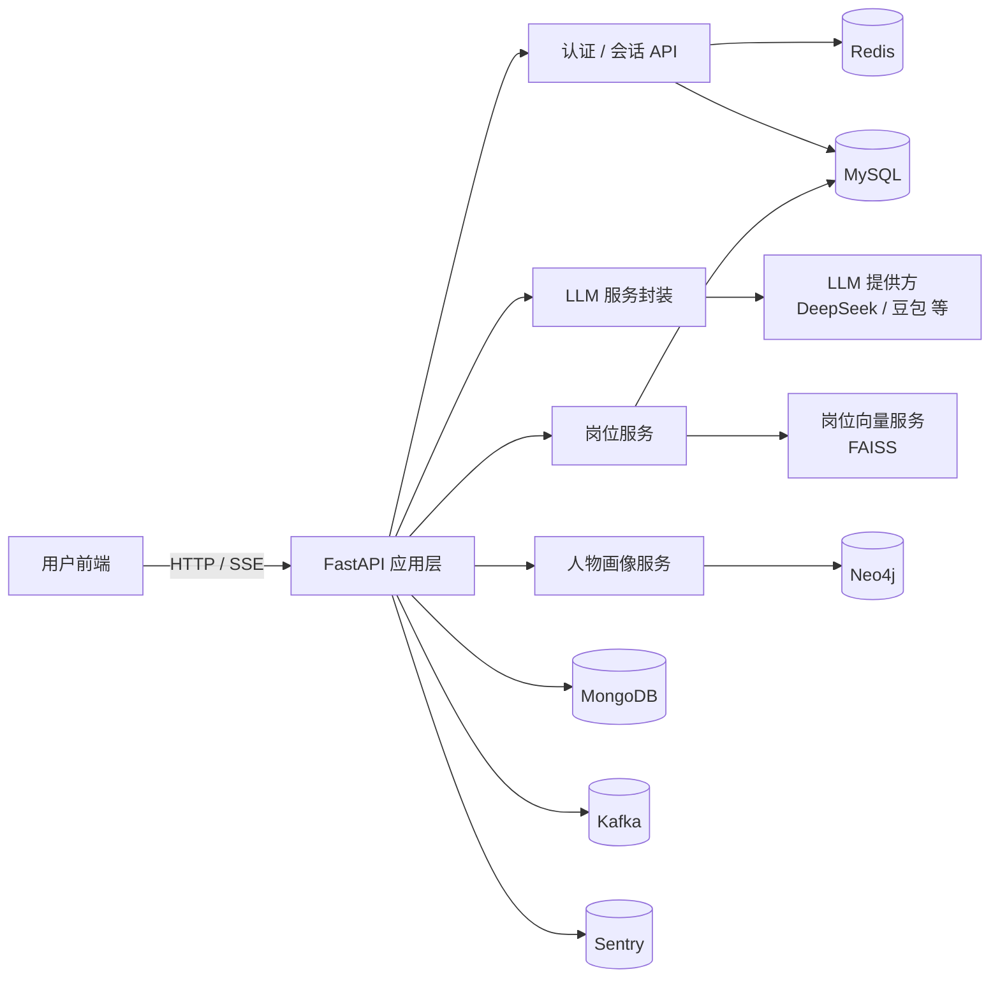
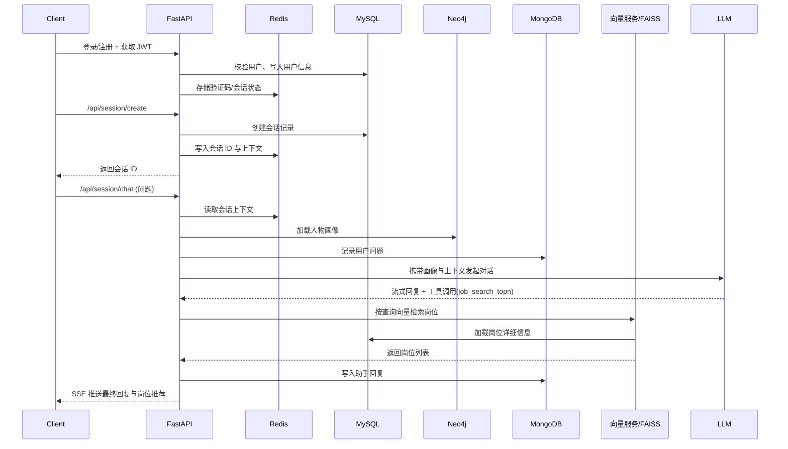

# jobRecommendAiAgent
岗位推荐聊天机器人后端（FastAPI）

## 功能概览
- 用户注册登录、邮箱验证码、图形验证码、JWT 鉴权
- 前后端 RSA 非对称加密登录，防止传输明文密码
- 会话管理与长上下文压缩，支持超长对话
- 职业人物画像建模（Neo4j 图数据库）
- 岗位向量检索与推荐（FAISS + 自定义 Embedding）
- 多数据源支持（MySQL / Redis / MongoDB / Neo4j / Kafka）

## 技术栈
- 后端框架：`FastAPI`、`Starlette`
- ORM 与数据库：`SQLAlchemy Async`、`aiomysql`
- 缓存与会话：`Redis`（`redis.asyncio`）
- 文档数据库：`MongoDB`（`motor`）
- 图数据库：`Neo4j`（`neo4j` async driver）
- 向量检索：`FAISS`、`langchain-core`、`langchain-community`
- 消息队列：`Kafka`（`aiokafka`，当前预留扩展）
- 邮件服务：`aiosmtplib` + 163 SMTP
- 监控与追踪：`sentry-sdk`
- 模型调用：兼容 OpenAI 协议（DeepSeek / 豆包 / 自建 Embedding）

## 系统架构



## 通信流程（岗位推荐）


## 目录结构
- `main.py`：FastAPI 应用入口，生命周期管理、路由挂载、中间件
- `api/`：业务接口层
  - `auth.py`：登录注册、图形验证码、邮箱验证码、RSA 公钥交换、JWT 刷新
  - `sessions.py`：会话创建、流式聊天、岗位推荐工具调用
- `config/`：配置与系统提示词（人物画像、对话压缩、会话命名等）
- `model/`：SQLAlchemy ORM 模型（用户、会话、岗位等）
- `schema/`：Pydantic 请求 / 响应模型
- `services/`：业务服务
  - `data.py`：聊天记录与压缩数据持久化
  - `job.py`：岗位数据相关逻辑
  - `llm.py`：LLM 调用封装、工具调用（`job_search_topn` 等）
  - `smtp.py`：邮件发送
  - `telemetry.py`：Sentry 遥测初始化
- `utils/`：工具与基础设施
  - `database.py`：MySQL / Redis / MongoDB / Neo4j 连接与初始化
  - `security.py`：密码哈希、JWT、OAuth2、RSA 工具
  - `normalize_salary.py`：薪资字段规整
- `MCP/`：向量服务与 Embedding
  - `vector_service.py`：岗位向量索引构建与检索（FAISS）
  - `embedding.py`：兼容 OpenAI 协议的异步 Embedding 封装
- `tokenizer/`：分词器配置与 token 统计
- `pre_data.py`：职位数据预处理脚本，将原始 CSV 清洗为 `data/job_pre.csv`
- `.env.example`：环境变量示例配置
- `requirements.txt`：Python 依赖

## 环境准备

### 1. Python 版本
- 推荐 `Python 3.10+`

### 2. 创建虚拟环境（Windows 示例）
```bash
python -m venv .venv
.\.venv\Scripts\activate
pip install -r requirements.txt
```

### 3. 环境变量配置
项目通过 `python-dotenv` 自动从 `.env` 读取配置，示例见 `.env.example`。

复制一份配置文件：

```bash
cp .env.example .env
```

然后根据实际环境修改以下关键项（只列出一部分，完整字段见 `.env.example` 和 `config/config.py`）：

- MySQL：`mysql_host`、`mysql_port`、`mysql_user`、`mysql_password`、`mysql_database`
- MongoDB：`mongo_host`、`mongo_port`、`mongo_database`、`mongo_user`、`mongo_password`
- Neo4j：`neo4j_host`、`neo4j_port`、`neo4j_user`、`neo4j_password`、`neo4j_database`
- Redis：`redis_host`、`redis_port`、`redis_database`
- Kafka：`kafka_host`、`kafka_port`
- 邮箱：`email_host`、`email_port`、`email_user`、`email_password`
- 模型配置：
  - DeepSeek：`deepseek_api_key`、`deepseek_model_name`、`deepseek_base_url`
  - 豆包：`doubao_api_key`、`doubao_model_name`、`doubao_base_url`
  - 向量服务：`embedding_api_base_url`、`embedding_api_key`、`embedding_model_name`
- FAISS 索引：`faiss_index_dir`（默认 `data/faiss_jobs/`）
- Sentry：`sentry_dsn`
- JWT：`jwt_secret`、`access_token_expires_minutes`、`refresh_token_expires_days`

### 4. 数据库与依赖服务

在启动应用之前，需要准备好以下服务（本地或远程均可）：
- MySQL：用于存储用户、会话、岗位等结构化数据
- Redis：用于验证码、会话状态、短期缓存
- MongoDB：用于存储完整聊天历史和压缩后的对话状态
- Neo4j：用于职业人物画像图谱
- Kafka：预留的消息队列（未来可接入异步任务 / 日志等）

应用启动时会自动完成：
- 初始化 MySQL 表结构（`utils/database.py:init_db`）
- 初始化数据库连接池与缓存客户端
- 初始化向量服务（`MCP/vector_service.py:init_job_vector_service`）
- 初始化 Sentry、LLM 等服务

## 运行项目

### 开发环境运行

```bash
uvicorn main:app --host 0.0.0.0 --port 8000 --reload
```

或直接使用内置启动脚本：

```bash
python main.py
```

服务启动后默认提供以下接口（仅列核心，具体以代码为准）：
- `GET /`：健康检查
- `GET /api/auth/image_code`：图形验证码
- `GET /api/auth/verify_code`：邮箱验证码发送
- `POST /api/auth/register`：用户注册
- `POST /api/auth/login`：用户登录
- `POST /api/auth/refresh`：刷新访问令牌
- `GET /api/session/create`：创建新的聊天会话
- `POST /api/session/chat`：岗位推荐聊天（SSE 流式返回）

## 岗位推荐流程概览

1. 用户完成注册登录，获得 JWT 访问令牌与刷新令牌。
2. 调用 `/api/session/create` 创建会话，后台写入 MySQL 与 Redis。
3. 用户通过 `/api/session/chat` 提问，后端从：
   - Neo4j 中加载人物画像（`generate_character_portrait` 等）
   - Redis 中加载当前会话上下文
4. LLM 根据用户画像与问题生成回复，同时通过工具 `job_search_topn` 调用向量检索服务：
   - `MCP.JobVectorService` 在 FAISS 索引中按向量相似度查询岗位
   - 结合岗位标题、描述、技能、薪资等返回 topN 个匹配岗位
5. 对话历史过长时，通过压缩提示词将历史压缩为摘要，继续用于后续推理。

## 授权协议

本项目使用 `Apache-2.0` 开源协议，详见根目录下的 `LICENSE` 文件。
